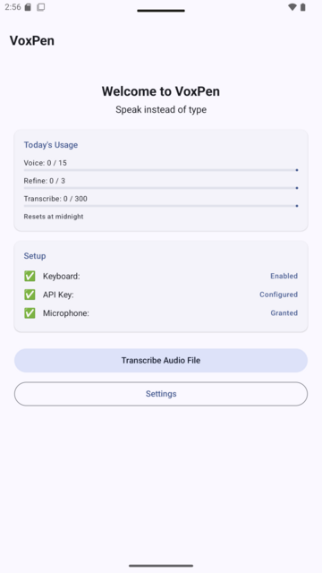
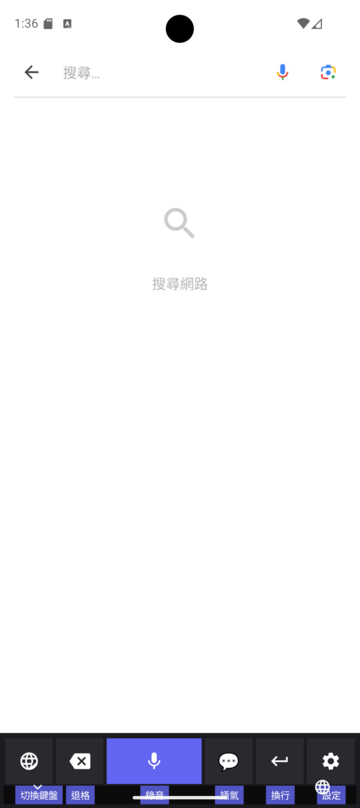
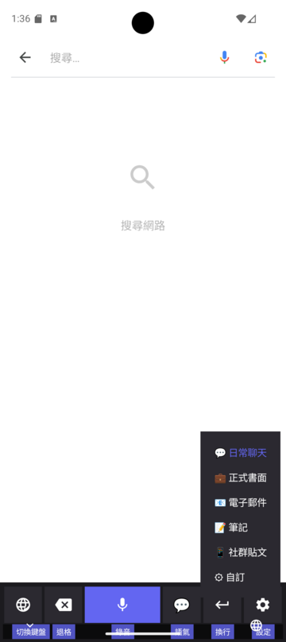
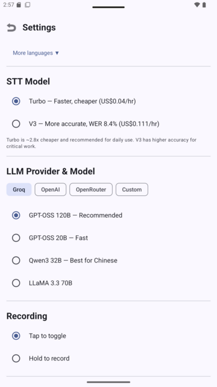
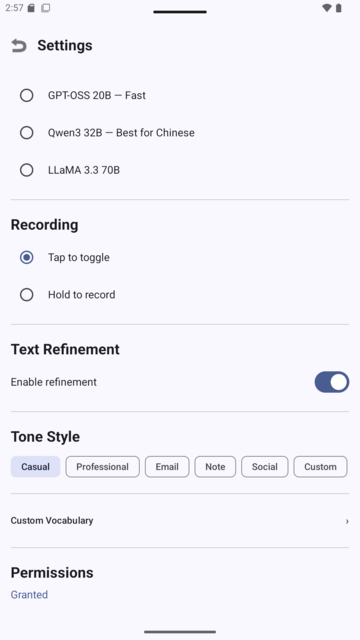

<p align="center">
  
</p>

<h1 align="center">VoxPen (語墨)</h1>

<p align="center">
  Open-source AI voice keyboard for Android.<br/>
  Speak naturally — get polished text instantly.
</p>

<p align="center">
  <a href="https://github.com/soanseng/voxpen-android/releases"></a>
  <a href="LICENSE"></a>
  <a href="https://github.com/soanseng/voxpen-android/actions"></a>
  
</p>

<p align="center">
  <a href="https://voxpen.app">Website</a> &nbsp;|&nbsp;
  <a href="README.zh-TW.md">繁體中文</a>
</p>

---

## Screenshots

<p align="center">
  
  &nbsp;&nbsp;
  
  &nbsp;&nbsp;
  
  &nbsp;&nbsp;
  
  &nbsp;&nbsp;
  
</p>

---

## What is VoxPen?

VoxPen is an Android voice keyboard that transcribes your speech with Whisper, refines it with an LLM, and inserts clean text into any app. It runs on a **BYOK (Bring Your Own Key)** model — you use your own API keys and pay only for what you use. No subscription, no data collection, fully open-source.

## Features

### Voice Dictation
Tap the mic and speak. VoxPen sends audio to Whisper for transcription, optionally refines with an LLM, and shows both versions in the candidate bar. Tap to insert.

### Translation Mode
Speak in one language, output in another. Quick-switch target languages directly from the keyboard — no need to open Settings.

### Speak to Edit
Select text in any app, switch to VoxPen, enable Edit Mode, and speak your instruction (e.g., "make it more formal"). The LLM rewrites the selection in place.

### Auto Tone
VoxPen detects the active app and auto-selects the appropriate writing style — casual for messaging, formal for email, professional for Slack. Customizable per-app rules.

### Voice Commands
10 trilingual commands (zh-TW / en / ja) — send, delete, newline, space, undo, select all, copy, paste, cut, clear all. No API call needed.

### Audio File Transcription
Transcribe audio/video files with progress tracking. Export as TXT or SRT subtitles.

### Privacy-First
- **BYOK**: Audio goes directly from your device to your API provider
- **No telemetry**, no analytics, no user accounts
- API keys encrypted with Android Keystore
- Only 2 permissions: `INTERNET` + `RECORD_AUDIO`

## Keyboard Layout

```
┌──────────────────────────────────────┐
│  🔄 說中文 → English            [×] │  ← translation indicator
│  🔵 Original: [raw transcription]    │  ← tap to insert
│  ✨ Refined:  [polished text]        │  ← tap to insert
├──────────────────────────────────────┤
│  🌐  │  ⌫  │    🎤    │  ⏎  │  ⚙️  │
└──────────────────────────────────────┘
```

| Button | Tap | Long-press |
|--------|-----|------------|
| 🌐 | Previous keyboard | System IME picker |
| ⌫ | Backspace | — |
| 🎤 | Start/stop recording | — |
| ⏎ | Enter | — |
| ⚙️ | Open Settings | Quick settings (language / refinement / translation / edit mode) |

## Supported Languages

| Language | STT | LLM Refinement | Translation |
|----------|-----|----------------|-------------|
| 中文（繁體） | Whisper | Dedicated prompt | Target/source |
| English | Whisper | Dedicated prompt | Target/source |
| 日本語 | Whisper | Dedicated prompt | Target/source |
| Auto-detect | Whisper | Mixed-language prompt | — |

Whisper supports 99 languages for STT. VoxPen currently exposes 3 + auto-detect with dedicated refinement prompts.

## Supported Providers

| Provider | STT | LLM | Notes |
|----------|-----|-----|-------|
| **Groq** | Whisper large-v3-turbo | LLaMA, Qwen, etc. | Free tier available |
| **OpenAI** | Whisper, GPT-4o transcribe | GPT-4o, etc. | |
| **Anthropic** | — | Claude | LLM only |
| **Custom** | Any Whisper-compatible endpoint | Any OpenAI-compatible endpoint | Self-hosted support |

## Getting Started

### Install from Release

1. Download the latest APK from [Releases](https://github.com/soanseng/voxpen-android/releases)
2. Install on your Android device (8.0+)
3. Follow the onboarding wizard to set up your API key

### Build from Source

**Prerequisites**: Android Studio Ladybug+ / JDK 17

```bash
git clone https://github.com/soanseng/voxpen-android.git
cd voxpen-android
./gradlew assembleDebug
```

The debug APK will be at `app/build/outputs/apk/debug/app-debug.apk`.

### Setup

1. Get a free Groq API key at [console.groq.com](https://console.groq.com)
2. Open VoxPen → enter your API key
3. Enable VoxPen Voice in **Settings → System → Keyboard**
4. Switch to VoxPen in any text field and start speaking

## Architecture

```
┌─────────────┐
│   IME Layer  │  VoxPenIME (InputMethodService)
│              │  AudioRecorder, KeyboardView, CandidateView
├──────────────┤
│  Domain      │  TranscribeAudioUseCase, RefineTextUseCase, EditTextUseCase
├──────────────┤
│  Data        │  SttRepository, LlmRepository, SettingsRepository
│              │  Retrofit APIs, Room DB, DataStore
├──────────────┤
│  DI          │  Hilt modules (AppModule, NetworkModule)
└──────────────┘
```

- **Language**: Kotlin
- **UI**: Jetpack Compose + Material 3
- **DI**: Hilt
- **Async**: Coroutines + Flow
- **Network**: Retrofit + OkHttp
- **Storage**: DataStore (preferences) + Room (history)
- **Testing**: JUnit 5 + MockK + Turbine

## Contributing

Contributions are welcome! Here's how:

1. Fork the repository
2. Create a feature branch (`git checkout -b feature/my-feature`)
3. Make your changes
4. Run tests: `./gradlew test`
5. Run lint: `./gradlew ktlintCheck detekt`
6. Commit with conventional commits (`feat:`, `fix:`, `refactor:`, etc.)
7. Open a Pull Request

### Development Notes

- The project follows TDD (Test-Driven Development) — write tests first
- Run `./gradlew test` before submitting PRs
- IME testing requires a physical device or emulator with keyboard enabled
- See [CLAUDE.md](CLAUDE.md) for detailed architecture documentation

## License

```
Copyright 2026 VoxPen Contributors

Licensed under the Apache License, Version 2.0 (the "License");
you may not use this file except in compliance with the License.
You may obtain a copy of the License at

    http://www.apache.org/licenses/LICENSE-2.0

Unless required by applicable law or agreed to in writing, software
distributed under the License is distributed on an "AS IS" BASIS,
WITHOUT WARRANTIES OR CONDITIONS OF ANY KIND, either express or implied.
See the License for the specific language governing permissions and
limitations under the License.
```

VoxPen is forked from [Dictate Keyboard](https://github.com/DevEmperor/Dictate) by DevEmperor (Apache 2.0). It has been fully rewritten in Kotlin with a new architecture.

## Privacy

VoxPen uses a BYOK model. Your audio is sent directly from your device to the API provider you choose. We never see your data. See the full [Privacy Policy](docs/privacy-policy.md).
